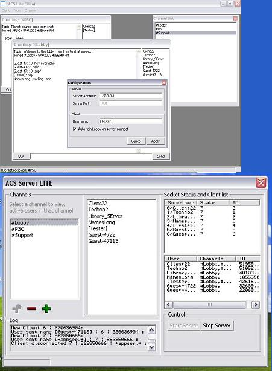



## Advanced Chat Service \- LITE

### Description

ACS Lite chat program features simultaneous clients, multiple channels a stable server, and a nice client. Be sure to connect to my chat server after you download! pscchat.mine.nu port 1001.
 
### More Info
 

             |
---                |---
**Submitted On**   |2003-05-09 05:11:28
**By**             |[Tecc](https://github.com/Planet-Source-Code/PSCIndex/blob/master/ByAuthor/tecc.md)
**Level**          |Advanced
**User Rating**    |5.0 (15 globes from 3 users)
**Compatibility**  |VB 6\.0
**Category**       |[Internet/ HTML](https://github.com/Planet-Source-Code/PSCIndex/blob/master/ByCategory/internet-html__1-34.md)
**World**          |[Visual Basic](https://github.com/Planet-Source-Code/PSCIndex/blob/master/ByWorld/visual-basic.md)
**Archive File**   |[Advanced\_C158546592003\.zip](https://github.com/Planet-Source-Code/tecc-advanced-chat-service-lite__1-45370/archive/master.zip)

